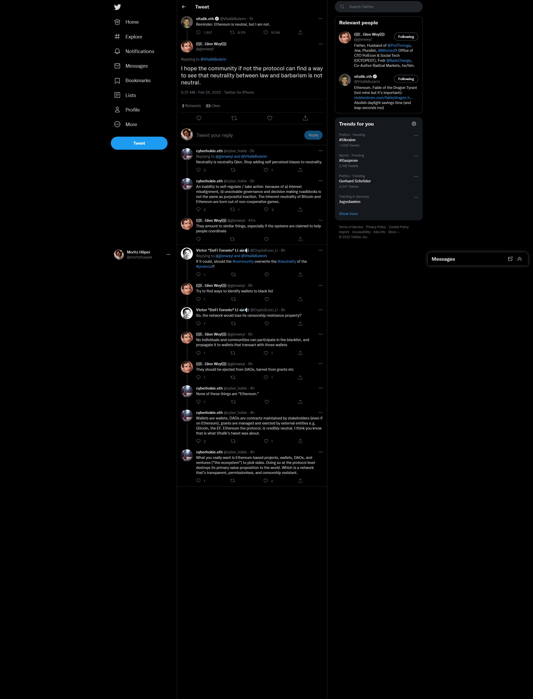

# Ethereum ist neutral

Als Reaktion auf Putins' Angriff auf die Ukraine veröffentlicht [[Vitalik Buterin]] am 24.02.2022 auf Twitter zeitgleich zwei Posts. Den einen auf russisch und den anderen auf englisch:

> Очень расстроен решением Путина отказаться от возможности мирного решения спора с Украиной и вместо этого начать войну. Это преступление против украинского и русского народа Хочу желать всем безопасности, хотя знаю, что не какой безопасности не будет.
>
> Слава Украине.
> 
> -- 4:56 AM · Feb 24, 2022 https://twitter.com/VitalikButerin/status/1496695424387801090

> Reminder: Ethereum is neutral, but I am not.
> 
> -- 4:56 AM · Feb 24, 2022 https://twitter.com/VitalikButerin/status/1496695587495981056

Während Buterin in dem auf russisch verfassten Tweet seine Haltung gegenüber Putin zum Ausdruck bringt, indem er sich auf der Seite der Ukraine positioniert, bringt er in einem zweiten Tweet [[Ethereum]] ins Spiel und behauptet: "[[Ethereum is neutral]]".

[[E Glen Weyl|E. Glen Weyl]] reagiert um 5:37 AM auf Buterins' englischen Tweet mit einer Andeutung:
> I hope the community if not the protocol can find a way to see that neutrality between law and barbarism is not neutral.
> 
> -- 5:37 AM · Feb 24, 2022 https://twitter.com/glenweyl/status/1496705824780996608

Daraufhin kommt es zu einem (eventuell noch nicht abgeschlossenen) Austausch zwischen Weyl und weiteren Twitter-Accounts:

Buterin und Weyl sind beide Boardmember von [[RadicalXChange]].

Weyl bezieht sich in seiner Reaktion auf Buterins' Behauptung, Ethereum sei neutral und differenziert zwischen _Neutralität_ und _neutral sein_. Seine Reaktion impliziert, dass die Ethereum Community, wenn nicht das [[Regime|Protokoll]] (Der [[DAO fork]] war ein Upgrade des Protokolls) diesen Unterschied nicht mache. Weyl widerspricht Butkin damit und sagt: Weder die Community noch das Protokoll sind neutral.  
Im weiteren Verlauf führt Weyl aus, dass versucht werden solle Wege zu finden [[Wallet]]s zu _blacklisten_ (auf eine Sperrliste zu setzen). Einzelpersonen und Communities sollten an Sperrlisten mitwirken können und diese an Wallets reichen können, die Transaktionen mit gesperrten Wallets durchführen. Gesperrte Wallets sollten aus DAOs und von Stipendien ausgeschlossen werden. (vgl. https://twitter.com/glenweyl/status/1496711554477133826 f.)  
Dem hält cyberhokie.eth entgegen, dass Weyl eigentlich wolle, dass Ethereum-basierte Projekte, Wallets, DAOs und Ventures ("das Ökosystem") sich für eine Seite entscheiden, denn tue man das auf Protokollebene, zerstöre man das primäre Werteversprechen an die Welt, das ein transparentes, erlaubnisfreies und zensurresistentes Netzwerk sei. (vgl. https://twitter.com/cyber_hokie/status/1496738593645240320) 

[Vitalik Buterin]: <Vitalik Buterin.md> "Vitalik Buterin"
[Ethereum]: Ethereum.md "Ethereum"
[Ethereum is neutral]: <Ethereum is neutral.md> "Ethereum ist neutral"
[E Glen Weyl|E. Glen Weyl]: <E Glen Weyl.md> "E. Glen Weyl"
[RadicalXChange]: RadicalxChange.md "RadicalxChange"
[Regime|Protokoll]: Regime.md "Protokoll"
[DAO fork]: <DAO fork.md> "DAO fork"